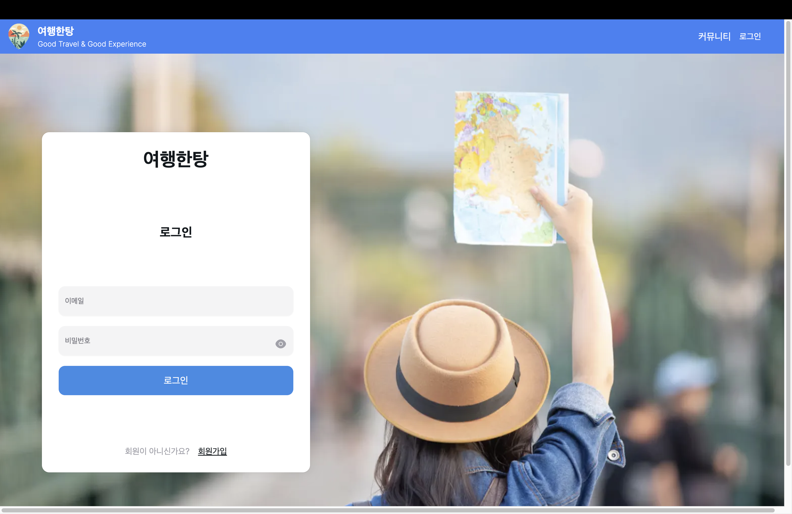
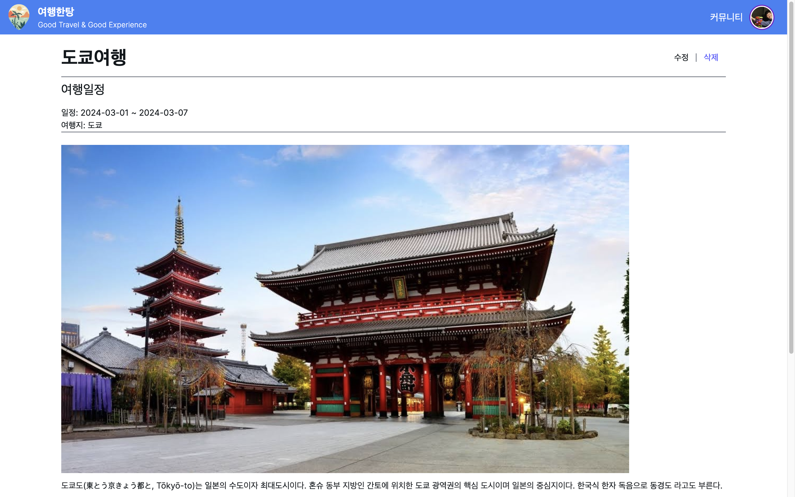

# 여행한탕 - Good Travel & Good Experience"

<p align="center">
  
</p>
<p align="center">
여행을 함께 즐기고 그 경험을 즐겁게 소통하는 커뮤니티
</p>

# 여행한탕 Web Page v0.1.0

> 내일배움캠프 React 4기 가현님 8방미인❤️<br/>
> 개발기간 : 2024.03.18 ~ 2024.03.22

## 🔗 배포주소

> 정식 배포 페이지 : https://travel-next-js-mauve.vercel.app/

## 🏃 웹개발팀 소개

|                              김현주                              |                              신서연                              |                              정해준                              |                              김형민                              |                              김경연                              |
| :--------------------------------------------------------------: | :--------------------------------------------------------------: | :--------------------------------------------------------------: | :--------------------------------------------------------------: | :--------------------------------------------------------------: |
|  |  |  |  |  |
|                [@HY965](https://github.com/HY965)                |         [@seoyeon-1206](https://github.com/seoyeon-1206)         |          [@DecidedCard](https://github.com/DecidedCard)          |              [@C1oudys](https://github.com/C1oudys)              |        [@KyeongyeonKim](https://github.com/KyeongyeonKim)        |
|                            Front-End                             |                            Front-End                             |                            Front-End                             |                            Front-End                             |                            Front-End                             |
|                               리더                               |                               팀원                               |                               팀원                               |                               팀원                               |                               팀원                               |

## 🚩 프로젝트 소개

여행한탕 - "여행한탕" 웹 서비스는 여행을 함께 즐기고 그 경험을 즐겁게 소통하는 커뮤니티입니다.
<br/>
여행을 다녀온 후 자신의 여행 경험에 대해 기록하여 여행을 추억하고 서로의 여행 경험을 나누며 소통하는 커뮤니티 서비스 입니다.

## 🛠️ 시작 가이드

### Installation

```
$ git clone https://github.com/DecidedCard/travel-Next.js.git
$ cd travel-Next.js
```

#### 환경 변수 설정

root 디렉토리에 .env 파일을 생성하고 환경변수를 입력 후 저장해주세요.

```
NEXT_PUBLIC_SUPABASE_URL = supabase URL
NEXT_PUBLIC_SUPABASE_KEY = supabase API Key
```

#### Frontend

```
$ cd travel-Next
$ yarn install
$ yarn json
$ yarn start
```

# 📚 Stacks

### Environment


### Config


### Development


### Hosting


### Communication


<br />

## 🗂️ 디렉토리 구조

```
📦src
 ┣ 📂app
 ┃ ┣ 📂community
 ┃ ┃ ┗ 📜page.tsx
 ┃ ┣ 📂detail
 ┃ ┃ ┗ 📂[id]
 ┃ ┃ ┃ ┗ 📜page.tsx
 ┃ ┣ 📂login
 ┃ ┃ ┣ 📜EyeFilledIcon.tsx
 ┃ ┃ ┣ 📜EyeSlashFilledIcon.tsx
 ┃ ┃ ┗ 📜page.tsx
 ┃ ┣ 📂signUp
 ┃ ┃ ┗ 📜page.tsx
 ┃ ┣ 📂userProfile
 ┃ ┃ ┗ 📜page.tsx
 ┃ ┣ 📂write
 ┃ ┃ ┗ 📜page.tsx
 ┃ ┣ 📜Provider.tsx
 ┃ ┣ 📜globals.css
 ┃ ┣ 📜layout.tsx
 ┃ ┗ 📜page.tsx
 ┣ 📂assets
 ┃ ┣ 📜defaultUser.png
 ┃ ┣ 📜loginImg.jpg
 ┃ ┣ 📜mainimage.jpg
 ┃ ┗ 📜sky.jpg
 ┣ 📂components
 ┃ ┣ 📂communityComponents
 ┃ ┃ ┣ 📜CommunityForm.tsx
 ┃ ┃ ┣ 📜CommunityList.tsx
 ┃ ┃ ┗ 📜SearchCommunity.tsx
 ┃ ┣ 📂detailComponents
 ┃ ┃ ┣ 📜CommentEditForm.tsx
 ┃ ┃ ┣ 📜CommentInputForm.tsx
 ┃ ┃ ┣ 📜CommentList.tsx
 ┃ ┃ ┣ 📜Comments.tsx
 ┃ ┃ ┗ 📜PostDetail.tsx
 ┃ ┣ 📂profile
 ┃ ┃ ┣ 📜ContentList.tsx
 ┃ ┃ ┗ 📜Profile.tsx
 ┃ ┣ 📂writeComponents
 ┃ ┃ ┣ 📜InputForm.tsx
 ┃ ┃ ┗ 📜QuillEditor.tsx
 ┃ ┣ 📜Footer.tsx
 ┃ ┗ 📜Header.tsx
 ┣ 📂hook
 ┃ ┣ 📂detail-write-hook
 ┃ ┃ ┣ 📜useComment.ts
 ┃ ┃ ┣ 📜useDetailPost.ts
 ┃ ┃ ┣ 📜useDetailQuery.ts
 ┃ ┃ ┣ 📜useUserInfo.ts
 ┃ ┃ ┗ 📜useWriteInputForm.ts
 ┃ ┣ 📜authService.ts
 ┃ ┣ 📜useInput.ts
 ┃ ┣ 📜usePostData.ts
 ┃ ┣ 📜useSetMutation.ts
 ┃ ┗ 📜useSortPosts.ts
 ┣ 📂store
 ┃ ┣ 📜authStore.ts
 ┃ ┣ 📜communityStore.ts
 ┃ ┗ 📜postBasicImageStore.ts
 ┣ 📂types
 ┃ ┣ 📜index.ts
 ┃ ┗ 📜writePage.ts
 ┗ 📂util
 ┃ ┣ 📂detail-writeSupaBase
 ┃ ┃ ┣ 📜detailSupaBase.ts
 ┃ ┃ ┗ 📜writeSupaBase.ts
 ┃ ┣ 📜quillImageHandler.ts
 ┃ ┗ 📜supabase.ts
```

<br />

## 💻 화면 구성

|       로그인 페이지        |              메인 페이지               |
| :------------------------: | :------------------------------------: |
|     |                |
|        상세 페이지         |            커뮤니티 페이지             |
|  |  |
|        마이 페이지         |                                        |
|  |                                        |

## 📦 주요 기능

#### ⭐️ 로그인 기능

- 로그아웃 상태에서도 여행 일기 검색 및 커뮤니티 조회 기능을 사용할 수 있습니다.
- 로그인을 원할 경우, 헤더에 위치한 로그인 버튼을 클릭하면 로그인 페이지로 이동합니다.
- 로그인 후 사용자는 자동으로 홈 페이지로 이동하며, 헤더에 표시된 사용자의 프로필을 통해 현재 로그인 상태를 확인할 수 있습니다.
- 아직 회원이 아니라면, 아이디, 비밀번호, 닉네임을 입력하여 회원가입을 진행할 수 있습니다.
- 회원가입 과정에서 유효하지 않은 정보를 입력한 경우, 알림창이 표시됩니다.
- 여행 일기 작성, 커뮤니티 글 작성, 프로필 변경 등의 회원 정보가 필요한 기능들은 로그인하거나 회원가입을 완료한 후에 이용 가능합니다.

#### ⭐️ 메인 페이지

- 헤더의 프로필 이미지를 클릭해 글쓰기, 마이페이지, 로그인 페이지로 이동할 수 있습니다.
- 헤더의 커뮤니티를 클릭해 커뮤니티 페이지로 이동할 수 있습니다.
- 키워드 검색 기능을 통해 해당하는 여행 일기를 조회할 수 있습니다.
- 최신 순, 오래된 순, 댓글 순으로 여행 글을 조회할 수 있습니다.
- 특정 여행 일기의 자세히 보기 버튼을 누르면 상세 글을 볼 수 있습니다.

#### ⭐️ 상세 페이지

- 로그인 후 여행 일기를 작성할 수 있습니다.
- 여행 일정을 선택할 수 있으며 여행지를 작성하고 사진을 업로드 하거나 글을 작성할 수 있습니다.
- 자신이 쓴 여행 일기는 로그인 후 수정/삭제 할 수 있습니다.
- 로그인 후 코맨트를 입력할 수 있습니다.
- 자신이 쓴 코멘트는 로그인 후 수정/삭제 할 수 있습니다.

#### ⭐️ 커뮤니티

- 회원가입 후 커뮤니티에 글을 작성할 수 있습니다.
- 자신의 쓴 글은 로그인 후 수정/삭제 할 수 있습니다.
- 키워드 검색 기능을 통해 해당하는 글을 조회할 수 있습니다.

#### ⭐️ 마이 페이지

- 헤더의 프로필 이미지를 눌러 마이페이지로 이동할 수 있습니다.
- 로그인 후 닉네임과 프로필 사진을 변경할 수 있습니다.
- 등록한 게시글을 모아 볼 수 있습니다.
- 댓글을 작성한 게시글을 모아 볼 수 있습니다.
  <br />

## 🚦 트러블 슈팅

<details>
<summary> hydration 오류 </summary>

<div>

1.  문제 상황 <br />
    서버 사이드 렌더링(SSR)과 클라이언트 사이드 렌더링(CSR) 간에 초기 UI가 서로 일치하지 않아 오류가 발생했습니다.
    <br />

2.  시도 <br />
    authService에서 localStorage를 사용한 문제였습니다. Next.js 서버 측에서 페이지를 렌더링할 때 브라우저의 localStorage에 액세스할 수 없으므로 서버 렌더링 콘텐츠와 클라이언트 렌더링 콘텐츠가 일치하지 않았습니다.

3.  해결방안 <br />
    localStorage 로직을 useEffect 후크 안에서 처리해서 클라이언트 측에서 마운트된 후에만 localStorage에 엑세스 하도록 했습니다.

    ```tsx
    const Header = () => {
    const { isLoggedIn, user, authLogout, authLogin } = useAuthStore();

        useEffect(() => {
          const getUserFromStorage = (): User | null => {
            if (typeof window !== "undefined") {
              // localStorage 액세스를 useEffect 후크 내부로 이동하여 클라이언트 측에서만 실행되도록
              const userString = localStorage.getItem("user");
              return userString ? JSON.parse(userString) : null;
            }
            return null;
          };
          const storedUser = getUserFromStorage();
          if (storedUser) {
            authLogin(storedUser);
          }
        }, [authLogin]);

    ```

    ```tsx
    import { User } from "@/types";
    import { create } from "zustand";

    interface AuthState {
      user: User | null;
      isLoggedIn: boolean;
      authLogin: (user: User) => void;
      authLogout: () => void;
    }

    const useAuthStore = create<AuthState>((set) => ({
      user: null,
      isLoggedIn: false,
      authLogin: (user) =>
        set((state) => ({
          user,
          isLoggedIn: true,
        })),
      authLogout: () =>
        set((state) => ({
          user: null,
          isLoggedIn: false,
        })),
    }));

    export default useAuthStore;
    ```

</div>
</details>
<details>
<summary> 추가 </summary>
<div>
여기에 내용
</div>
</details>
